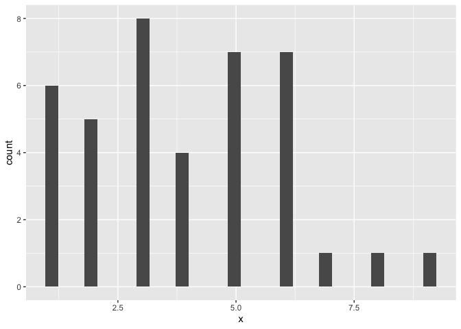
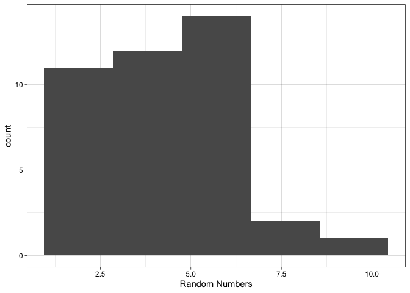
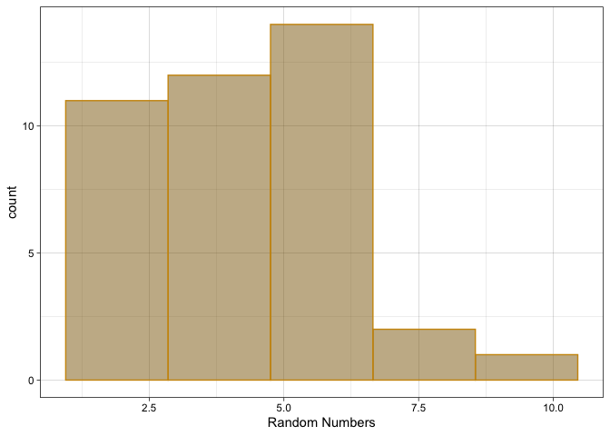

<!-- README.md is generated from README.Rmd. Please edit that file -->

# optimal

<!-- badges: start -->
<!-- badges: end -->

The goal of optimal is to create graphs, using ggplot2, with certain
parameters, such as bin-width for histograms, automatically chosen
according to pre-established mathematical equations. When creating
graphs, especially using ggplot2 in R, there are certain parameters that
are chosen by the creator of the graph. When creating histograms, for
example, the bin width can be manually chosen by creator of the graph.
Since graphs are a form of data visualization and are often used to form
conclusions, the choice of these parameters is an important one. As
such, there should be an automated, consistent method of choosing these
parameters that is justified by sound mathematical equations. This is
what optimal does. The functions in optimal are organized according to
the type of graph created.

## Installation

You can install the development version of optimal from
[GitHub](https://github.com/) with:

``` r
# install.packages("devtools")
devtools::install_github("stat545ubc-2022/assignment-b1-and-b2-simranpreetmann")
```

## Usage

Histograms are a wonderful graphical representation of the distribution
of numerical data. In R, `ggplot2::ggplot()` and
`ggplot2::geom_histogram()` are commonly used to create histograms.

``` r
x <- c(1,1,1,1,1,3,2,4,6,5,2,3,1,6,5,3,6,3,3,2,5,4,6,2,3,4,5,6,8,9,5,5,6,7,2,3,6,5,4,3)
ggplot2::ggplot(mapping = ggplot2::aes(x)) +
    ggplot2::geom_histogram()
#> `stat_bin()` using `bins = 30`. Pick better value with `binwidth`.
```



Notice the following warning that is returned when the histogram above
was created: Pick better value with `binwidth`. Below, we will use
`optimal::optimal_histogram()` to create an updated version of the
histogram above, with the binwidth automatically chosen for us,
according to the Freedman-Diaconis rule which is commonly used to select
the width of bins in statistical analyses. In addition to this, the
`optimal::optimal_histogram()` function also allows us to easily specify
the label of the x-axis using the second argument.

``` r
library(optimal)

optimal_histogram(x, "Random Numbers")
```



Given that `optimal_histogram()` is built on `ggplot2::geom_histogram()`
and `ggplot2::ggplot()`, you can use arguments that are commonly
available in these functions as well. The use of `optimal_histogram()`
with these additional arguments is shown below!

``` r
optimal_histogram(x, "Random Numbers", fill = "darkgoldenrod4", color = "darkgoldenrod3", alpha = 0.5)
```



Please note that `optimal_histogram()` is meant to visualize the
distribution of numerical variables only. As such, it will return an
error if its input for the argument “x” is a categorical variable!
