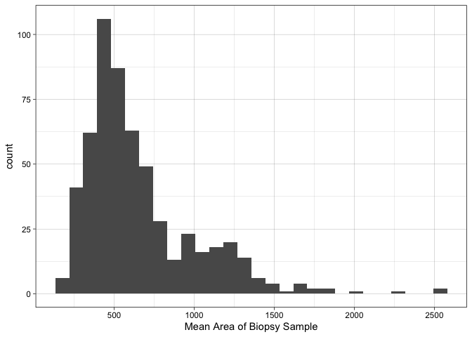
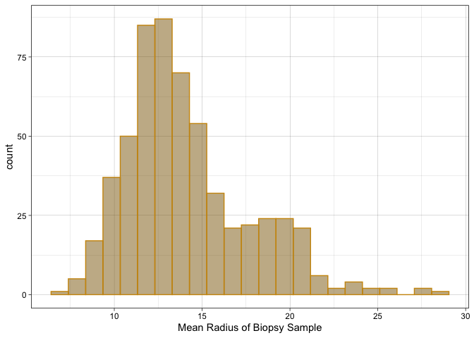

Assignment B1
================

The code chunk below is used to load the required packages.

``` r
library(datateachr)
library(tidyverse)
```

    ## ── Attaching packages ─────────────────────────────────────── tidyverse 1.3.2 ──
    ## ✔ ggplot2 3.3.6      ✔ purrr   0.3.5 
    ## ✔ tibble  3.1.8      ✔ dplyr   1.0.10
    ## ✔ tidyr   1.2.1      ✔ stringr 1.4.1 
    ## ✔ readr   2.1.3      ✔ forcats 0.5.2 
    ## ── Conflicts ────────────────────────────────────────── tidyverse_conflicts() ──
    ## ✖ dplyr::filter() masks stats::filter()
    ## ✖ dplyr::lag()    masks stats::lag()

``` r
library(testthat)
```

    ## 
    ## Attaching package: 'testthat'
    ## 
    ## The following object is masked from 'package:dplyr':
    ## 
    ##     matches
    ## 
    ## The following object is masked from 'package:purrr':
    ## 
    ##     is_null
    ## 
    ## The following objects are masked from 'package:readr':
    ## 
    ##     edition_get, local_edition
    ## 
    ## The following object is masked from 'package:tidyr':
    ## 
    ##     matches

# **<span style="color: deeppink;">Exercise 1 & 2: Creating and Documenting the Function</span>**

The code chunk below is used to create the function, named
optimal_histogram(), and document it using roxygen2 tags.

``` r
#' Optimal Histogram
#'
#' This function creates a histogram with the optimal bin-width, as calculated by the Freedman-Diaconis rule. It is a wrapper for geom_histogram().
#'
#' @param x A list containing values belonging to the following data types: numeric, integer or NA. This parameter is named x because it represents the numerical variable that will be plotted on the x-axis of this histogram.
#' @param axis An object of class "character", indicating the x-axis label. This parameter is named axis because its input is used create the label of the x-axis of the histogram.
#' @param ... Other parameters to pass to geom_histogram()
#'
#' @return A histogram plot that visualizes the distribution of x
#' @export
optimal_histogram <- function(x, axis, ...) {
  if (length(x) == 0) {
    warning("length of *x* must be greater than 0!")
    return(x)
  }
  stopifnot(is.na(x) | is.numeric(x) | is.integer(x))
  stopifnot(is.character(axis))

  x <- na.omit(x)

  optimal_bin_width <- ((IQR(x)) * 2) / (length(x)^(1 / 3))
  ggplot(mapping = aes(x)) +
    geom_histogram(binwidth = optimal_bin_width, ...) +
    labs(x = axis) +
    theme_linedraw()
}
```

# **<span style="color: deeppink;">Exercise 3: Examples</span>**

## **<span style="color: orange;">Example 1</span>**

Below is the most basic usage of the optimal_histogram() function. It
contains only the 2 necessary arguments (x, axis).

``` r
example_1 <- optimal_histogram(cancer_sample$area_mean, "Mean Area of Biopsy Sample")

print(example_1)
```

<!-- -->

## **<span style="color: orange;">Example 2</span>**

The example below demonstrates the use of additional arguments (…) to
further modify the histogram that is produced.

``` r
example_2 <- optimal_histogram(cancer_sample$radius_mean, "Mean Radius of Biopsy Sample", fill = "darkgoldenrod4", color = "darkgoldenrod3", alpha = 0.5)

print(example_2)
```

<!-- -->

## **<span style="color: orange;">Example 3</span>**

The example below shows that an error is produced when a categorical
variable (species of trees in Vancouver) is passed to the parameter x.

``` r
example_3 <- optimal_histogram(cancer_sample$diagnosis, "Species")
```

    ## Error in optimal_histogram(cancer_sample$diagnosis, "Species"): is.na(x) | is.numeric(x) | is.integer(x) are not all TRUE

``` r
print(example_3)
```

    ## Error in print(example_3): object 'example_3' not found

# **<span style="color: deeppink;">Exercise 4: Test the Function</span>**

The code chunks below are used to test the optimal_histogram() function.

## **<span style="color: orange;">Test 1</span>**

This test is done to ensure that the function returns an object of the
class “ggplot”.

``` r
test_that("Function returns a ggplot object", {
  expect_s3_class(optimal_histogram(c(2, 3, 3, 3, 3, 4, 2, 2, 5, 5, 5, 5, 3), "Numbers"), "ggplot")
  expect_s3_class(optimal_histogram(vancouver_trees$height_range_id, "Height Range ID"), "ggplot")
  expect_s3_class(optimal_histogram(cancer_sample$radius_mean, "Radius"), "ggplot")
})
```

    ## Test passed 🥳

## **<span style="color: orange;">Test 2</span>**

At times, data may be passed to x which contains NAs. The function deals
with this by omitting all occurrences of NA. This test is done to
confirm that this omission is occurring and to make sure that the
function won’t break down if NA is passed to it.

``` r
test_that("Function returns a ggplot object even when x contains NAs", {
  expect_true(is.ggplot(optimal_histogram(c(2, 3, 3, 3, NA, 4, 2, 2, 5, 5, 5, 5, 3), "Numbers")))
  expect_true(is.ggplot(optimal_histogram(c(2, 3, 3, NA, NA, 4, NA, 2, 5, 5, 5, 5, 3), "Numbers")))
})
```

    ## Test passed 🌈

## **<span style="color: orange;">Test 3</span>**

Since this function creates a histogram plot, it should return an error
if a non-numeric input is passed to x. This test is done to ensure that
the use of categorical variables results in an error.

``` r
test_that("Function returns error if non-numeric input passed to x", {
  expect_error(optimal_histogram(c(2, 3, 3, 3, 4, 4, 2, 2, 5, 5, "B", "C", 5, 5, 3), "Random Numbers and Letters"))
  expect_error(optimal_histogram(vancouver_trees$genus_name, "Genus Name"))
  expect_error(optimal_histogram(vancouver_trees$plant_area, "Plant Area"))
})
```

    ## Test passed 😸

## **<span style="color: orange;">Test 4</span>**

The x-axis of the histogram produced by this function is limited to
objects of type character. Thus, this test is done to ensure that
passing anything that is not a character to the parameter axis will
result in a warning.

``` r
test_that("Function returns error if argument passed to axis is not of type character", {
  expect_error(optimal_histogram(c(2, 3, 3, 3, 4, 4, 2, 2, 5, 5, 5, 5, 3), Numbers))
  expect_error(optimal_histogram(c(2, 3, 3, 3, 4, 4, 2, 2, 5, 5, 5, 5, 3), 3, ))
  expect_error(optimal_histogram(c(2, 3, 3, 3, 4, 4, 2, 2, 5, 5, 5, 5, 3), 3.4))
  expect_error(optimal_histogram(vancouver_trees$diameter, 3.4))
  expect_error(optimal_histogram(vancouver_trees$diameter, NA))
})
```

    ## Test passed 😀

## **<span style="color: orange;">Test 5</span>**

Sometimes, the counts of values may be so low that it seems like the
plot is blank. In such instances, it would be difficult to tell whether
the plot is actually blank because a vector of length 0 was passed to x,
or it simply seems blank due to the counts being very low. As a
precaution, the function has been designed to return a warning message
if a vector of length 0 is passed to x. This is tested below.

``` r
test_that("Function returns warning message if vector of length zero passed to x", {
  expect_warning(optimal_histogram(numeric(0), "No Numbers"), label = "length of x must be greater than 0")
})
```

    ## Test passed 🥳
